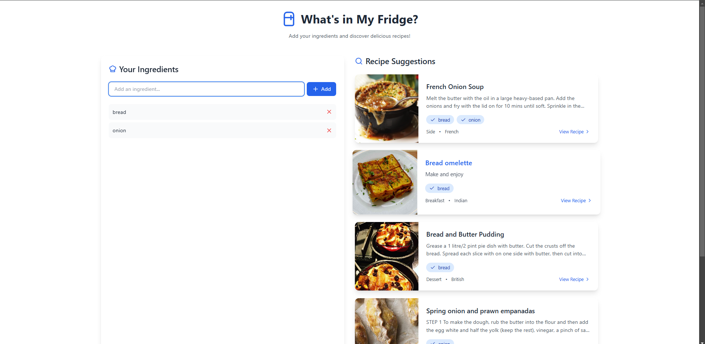

# 🍽️ What's in My Fridge

A beautiful, intuitive web application that helps you discover recipes based on ingredients you have in your fridge. Simply add your available ingredients, and let the app suggest delicious recipes you can make!

Live Website: [https://in-my-fridge-f6ik.vercel.app/](https://in-my-fridge-f6ik.vercel.app/)



## ✨ Features

- 🔍 **Smart Recipe Search**: Find recipes based on ingredients you have
- 📱 **Responsive Design**: Works seamlessly on desktop and mobile devices
- 🎥 **Video Tutorials**: Watch cooking videos when available
- 📊 **Ingredient Matching**: See which ingredients you have for each recipe
- 🌐 **Source Links**: Access original recipe sources

## 🛠️ Tech Stack

- **Frontend Framework**: React 18
- **Language**: JavaScript
- **Styling**: 
  - Tailwind CSS for utility-first styling
  - Custom CSS 
- **Data Source**: [TheMealDB API](https://www.themealdb.com/api.php)
- **Additional Libraries**:
  - `axios` for API requests
  - `lucide-react` for beautiful icons

## 🚀 Getting Started

1. **Clone the repository**
   ```bash
   git clone https://github.com/sourabh0902/inMyFridge
   ```

2. **Install dependencies**
   ```bash
   cd whats-in-my-fridge
   npm install
   ```

3. **Start the development server**
   ```bash
   npm run dev
   ```

4. **Open your browser**
   The app will be running at `http://localhost:5173`

## 💡 How to Use

1. **Add Ingredients**
   - Type ingredients you have in the input field
   - Click "Add" or press Enter to add them to your list

2. **Manage Ingredients**
   - Check the added ingredients
   - Click the X button to remove ingredients
   - A special 'Surprise Me' button is available to discover random recipes

3. **Discover Recipes**
   - Recipes will automatically update as you add/remove ingredients
   - Click on a recipe card to view detailed instructions
   - Access video tutorials and source links when available

## 🎨 UI Features

- **Responsive Design**: Adapts to any screen size
- **Smooth Animations**: Enhanced user experience with subtle transitions
- **Modern Interface**: Clean, intuitive design with clear visual hierarchy
- **Interactive Elements**: Hover states and visual feedback

## 🙏 Acknowledgments

- Recipe data provided by [TheMealDB](https://www.themealdb.com/)
- Icons by [Lucide](https://lucide.dev/)

## 💬 ChatGPT Chat Link

[Link to ChatGPT conversation](https://chatgpt.com/share/67303e1b-7914-8013-86a6-a9fdbc2313d4)

Oops! The previous chat link deleted. ChatGPT's memory got as full and was deleted by mistake!